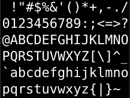

T2. Tipos de datos, variables y constantes
==========================================

---

# Recordemos el Temario

- *Tema 1 Introducción a la Informática (semipresencial)*
- **Tema 2 Tipos de datos, variables y constantes**
- *Tema 3 Operadores y Expresiones*
- *Tema 4 Funciones. Funciones de entrada y salida básica*
- *Tema 5 Estructuras de control para selección (`if` y `switch`)*
- *Tema 6 Estructuras de control para iteración (`while`, `do while` y `for`)*
- *Tema 7 Entrada y salida con ficheros*
- *Tema 8 Vectores y cadenas*
- *Tema 9 Matrices*

---

# Contenidos del tema 2

- **2.1** Qué son los tipos de datos
- **2.2** Tipos de datos básicos en C
- **2.4** Variables en C
- **2.3** Constantes en C

## Objetivos

- conocer los tipos de datos básicos en el lenguaje C
- saber utilizar los tipos de datos básicos más adecuados para cada caso
- saber declarar variables y constantes

---

# ¿Qué es un tipo de dato?

Ya sabes que con **n** bits puedes representar **2 elevado
a n** cosas diferentes.

No todos los datos se codifican igual en la memoria del ordenador.

## El tipo de datos indica:

- El conjunto de valores que pueden representarse
- Cómo se codifican internamente esos valores y el tamaño que ocupan (veremos la función `sizeof`)
- Las **operaciones** que podemos efectuar con ellos (lo veremos en el tema 3)
- Cómo se escriben esos valores en el código fuente de un programa: **literales**

---

# ¿Qué es un valor literal?

## Los valores que aparecen en el código fuente se llaman literales, ejemplos:
- `125` es un **entero**
- `1124.387` es un número en **coma flotante**
- `'a'` es un **caracter**, fíjate en las comillas **simples**
- `"esto es una cadena de caracteres"` ¡ojo! comillas **dobles**

## Ejercicio, busca literales en este programa en C:

	!c
	#include <stdio.h>
	int main() {
	  fprintf(stdout,"holaaaa letra %c\n", 'c');
	  fprintf(stdout,"holaaaa cadena %s\n", "ejemplo");
	  fprintf(stdout,"holaaaa numero %d\n", 12345);
	  return 0;
	}

---

# Clasificación de tipos de datos (en C)

## Tipos de datos simples o básicos
- Números enteros (ejemplo: `int`)
- Caracteres (letras, dígitos,...) con el tipo `char`
- Booleanos (valores cierto y falso)
- Números en "coma flotante" con `float` y `double`

## Tipos de datos compuestos
- Vectores (se verán en el **tema 8**) utilizan corchetes `[ ]`
- Las **cadenas de caracteres** son un caso particular de vectores (vectores de caracteres) (se verán en el **tema 8**), pero las usamos desde ya así `fprintf(stdout,"hola! soy un plasta con el hola");`

### Nota: no he contado cosas que NO se ven en la asignatura

---

# Enteros

## Sin signo

permiten representar valores desde el `0`, ejemplos:

- `unsigned char` ocupa 1 byte, permite representar enteros de **0** a **255**
- `unsigned int` (usualmente) valores entre **0** y **4294967295**

## Con signo

reparten la mitad del rango de opciones para negativos, ejemplos:

- `char` permite representar valores entre **-128** y **127**
- `int` (usualmente) valores entre **-2147483648** y **2147483647**

### Normalmente trabajaremos siempre con enteros *con signo*

---

# El tipo `char` en el lenguaje `C`

## Es ambivalente: es un *pequeño entero*

- ocupa 1 byte, representa valores en el rango -128 a 127

## pero también representa *un caracter*
- Cada caracter tiene asociado un código dado por la **tabla ASCII**

Las funciones de entrada y salida estándar utilizan `%c` (abreviatura de `char`)

    !c
    fprintf(stdout,"%c\n",'A');/* imprime A por pantalla */
    fprintf(stdout,"%c\n",65); /* tb imprime A ¿por qué? */

### Ojito con su caracter ambivalente de caracter y entero *pequeñito*
	
	!c
    fprintf(stdout,"%d\n",'A');  /* imprime 65 ¿por qué? */
    fprintf(stdout,"%c\n",'A'+1);/* imprime B ¿por qué? */

---

# El tipo `char` en el lenguaje `C`

## La tabla ASCII

- [ASCII](http://es.wikipedia.org/wiki/ISO_8859-1) significa **A**merican **S**tandard **C**ode for **I**nformation **I**nterchange.
- Asocia a cada código entre 0 y 127 un caracter (los primeros 31 son no imprimibles)

- Hay codificaciones que extienden
esta tabla hasta los 256 valores que representa un `char`. Por ejemplo, la codificación
[ISO_8859-1](http://es.wikipedia.org/wiki/ISO_8859-1) añade letras con acentos, la eñe, ç, etc.

---

# El tipo `char` en el lenguaje `C`

## Ejercicio

	!c
	fprintf(stdout,"dos numeritos %d %d\n",5,'5');
	
Muestra por pantalla:

	dos numeritos 5 53
	
¿por qué?

## Caracteres especiales

- `\0` fin de cadena
- `\n` cambio de línea
- `\t` tabulador
- `\\` contrabarra
- `\'` apóstrofe
- `\"` comillas

---

# Números en coma flotante

## Esto es lo que nos dice [wikipedia](http://es.wikipedia.org/wiki/Coma_flotante):
> La representación de coma flotante, es una forma de notación científica con la cual se pueden representar números reales extremadamente grandes y pequeños de una manera muy eficiente y compacta, y con la que se pueden realizar operaciones aritméticas.

## Internamente se guarda
- La **mantisa** determina el número de digitos **significativos**
- El **exponente** indica el **rango** de valores
- El **signo** (1 bit)

## Podemos elegir menor o mayor precisión
- `float` ocupa 32 bits (4 bytes) **NORMALMENTE USAREMOS ESTOS**
- `double` ocupa 64 bits (8 bytes)

---

# booleanos
- Se llaman así en honor a Georges Boole (matemático)
- Los literales serían `true` y `false`
- Las operaciones serían la **y lógica**, la **o lógica**, la **negación**

# PERO pero pero pero
- En el lenguaje `C` **NO** se utiliza ese tipo de datos :(, sino los **enteros** con el siguiente convenio:

# IMPORTANTE: en C, 0 es FALSO, distinto de 0 (!=0) es CIERTO
- 0 es falso, !=0 es cierto
- normalmente 0 falso, 1 cierto (pero cualquier otro valor !=0 también)
- POR SI NO QUEDA CLARO: 0 es falso, !=0 es cierto

---

# Cadenas de caracteres

## Son vectores de `char`

- Los vectores son como casilleros ordenados de elementos, pero ya lo veremos

## Sus literales van entre comillas, ejemplos:
- `"hola"`
- Puedes partir cadenas, el compilador las vuelve a unir: `"ho" "la"`

	    !c
		fprintf(stdout,"hola esto es una linea demasiado "
	            "larga, por eso la corto como me da la gana\n");

- Si las comillas delimitan las cadenas, ¿cómo narices metemos una comilla dentro de una cadena? usando **códigos de escape**:

	    !c
		"cadena con \"comillas\" y \n \t contrabarra \\ etc."

---

# Identificadores

Nombre dado a un elemento del programa (constantes simbólicas, variables y funciones). 

## Reglas para construir un identificador:
- Deben comenzar por letra (a..z o A..Z) o subrayado (_). 
- El resto del identificador puede constar de letras del alfabeto, dígitos numéricos o subrayado.
- No se admiten espacios.
- Se distinguen mayúsculas y minúsculas.
- No pueden coincidir con las **palabras reservadas** del lenguaje.

### Ejercicio ¿cuáles son válidos?
- `5a`
- `radio del círculo`
- `radio_del_circulo`

---

# Palabras reservadas:

## Identificadores que tienen un significado predefinido dentro del lenguaje

	!c
    auto     double  int      struct 
    break    else    long     switch 
    case     enum    register typedef    
    char     extern  return   union  
    const    float   short    unsigned   
    continue for     signed   void   
    default  goto    sizeof   volatile   
    do       if      static   while  

# Los nombres de los tipos `char`, `int` etc. son *palabras reservadas*
- Para indicar que una **función** recibe un valor de ese tipo o que lo devuelve
- Para declarar **variables** que guardan valores de un determinado tipo

---

# Variables

## Definición
- Son como cajas que contienen un valor de un determinado tipo de datos
- Su contenido puede **variar** a lo largo de la ejecución de un programa, por eso se llaman **variables**
- Tienen un nombre, debe de ser un  *identificador* válido, necesario para referirnos a ellas
- Ocupan espacio en memoria, dependiendo de su tipo ¡nunca de su nombre! Ocupan igual:

	    !c
		int a, supercalifragilisticoespialidoso;

- Es conveniente utilizar nombres que nos ayuden a entender el programa
- Tienen un **ámbito** (las partes del programa desde las cuales se pueden utilizar)

---

# Variables locales

## Declaración
- Se declaran **al principio** de una función
- Sintaxis:
    - `tipo_datos identificador;`
    - `tipo_datos id1, id2, id3;`
- Cuando una variable se declara, el compilador le reserva espacio en la memoria, pero **no está obligado a inicializar** el valor que había en dicho espacio.
- Toda variable debe ser inicializada antes de usar su valor en el programa, en otro caso su valor inicial es **desconocido**. Sintaxis:
    - `tipo_datos identificador=valor;`
    - `tipo_datos id1, id2=valor, id3;`

---

# Variables locales

## Ejemplo:

	!c
	#include <stdio.h> /* para usar fprintf */
	#include <conio.h> /* para usar getch */
	int main() { /* funcion principal */
		int a=5;    /* variable local a main */
		char c='A'; /* otra variable local */
		fprintf(stdout,"a vale %d\nc vale %c\n",a,c);
		getch(); /* espera que pulses una tecla */
		return 0;
	}

## Ámbito

Las variables locales **SOLAMENTE SON ACCESIBLES DENTRO DE SU
FUNCIÓN**. Solamente existen mientras se ejecuta la función.

---

# Variables argumento

- Como `base` y `altura` en este ejemplo:

	    !c
		float area_rectangulo(float base, float altura) {
			return base*altura;
		}
	
- Reciben su valor al llamar a la función (¡tranquilo!, lo veremos en el tema 3)

	    !c
		fprintf(stdout,
				"El area de un rectangulo "
				"de base %f y altura %f es %f\n",
				1.2, 4.5, area_rectangulo(1.2, 4.5) );

- No sirve la sintaxis `tipo variable, variable, variable`
- Hay que repetir cada vez el tipo aunque sean iguales, por eso hemos puesto 2 veces `float` en `float base, float altura`

---

# Cómo se usan las variables

## Consulta: las utilizarmos en las expresiones

    !c
	int a = 1234;
	fprintf(stdout,"%d\n",a*a); /* a elevado al cuadrado */
	fprintf(stdout,"%d\n",1234*1234); /* equivalente */

## Modificación de 2 maneras:
- Mediante una **ASIGNACIÓN**, con sintaxis `variable=valor`
- Utilizando una **función de lectura de datos**

### Ejemplo:

    !c
	creditos = 12; /* esto es una ASIGNACION */
	fprintf(stdout, "Escribe tu edad: ");
	fscanf(stdin, "%d", &edad); /* FIJATE EN EL SIMBOLO & */
	
### `fscanf` lee de teclado, `fprintf` imprime por pantalla	

---

# Variables

### Ejercicio

	!c
	int a=1, b=2;

¿Qué diferencia hay entre estas dos instrucciones?

1. `a=b;`
2. `b=a;`

### Ejercicio

	!c
	int a=1, b=2;

¿cómo intercambiar el valor de las dos variables?

### Ejercicio

	!c
	int a = 5;
	a = a+1;
	
¿qué hace la última instrucción?	

---

# Variables para cadenas

Cuando se declara una variable para guardar cadenas, debemos indicar el **TAMAÑO MÁXIMO en caracteres**.

### Ejemplo:

	!c
	char letra, palabra[20], frase[100];

### FÍJATE en la diferencia sintáctica entre declarar caracteres (letras individuales) y cadenas. Las cadenas llevan CORCHETES `[]` y dentro el tamaño máximo

### ¿qué pasa si pones en una variable de tipo cadena una cadena de longitud mayor al tamaño máximo?
- normalmente peta miserablemente
- también puede no petar y modificar erróneamente otras variables :(

---

# Constantes

En los ejemplos has visto líneas que empiezan con el caracter `#`

## `#include` sirve para incluir una biblioteca o librería

	!c
	#include <stdio.h> /* entrada salida estandar */
	#include <conio.h> /* console input output */

## `#define` sirve para definir *constantes*

	!c
	#define PI 3.141592
	#define mayoria_edad 18
	
- La sintaxis es `#define NOMBRE VALOR`
- El compilador **SUSTITUYE** cada aparición de `NOMBRE` por su `VALOR`

## IMPORTANTE

Las líneas que empiezan con `#` **no** terminan con `;` punto y coma 
	

